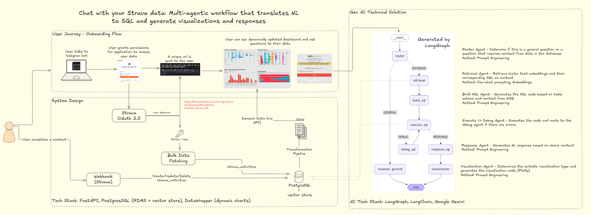
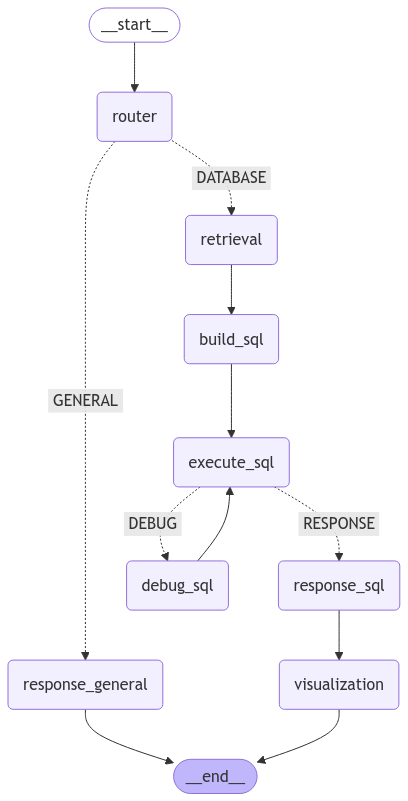

# Chat with your Strava data: Multi-agentic workflow that translates NL to SQL and generate visualizations and responses



- This repository consists of multiple integration components and it is NOT designed for you to run as a full application.
- The emphasis is for readers to understand the technical flow and how the Gen AI multi-agent system is implemented and integrated with the other components.
- Feel free to contact me if you would like to use the entire repository as a full application.

# Gen AI Architecture



# Tech Stack
Frontend: Wordpress, Old School HTML + CSS + JS  
Backend: Python, FastAPI, PostgreSQL (RDMS + Vector Store)  
AI Backend: LangChain, LangGraph, Google Gemini

# Startup Instructions
- For application
`python deploy_v2.py`
- For running Gen AI workflow
`python workflow_debug.py`

# Deployment Steps
- upload supervisor config file to /etc/supervisor/conf.d/
    - sudo supervisorctl reload
- update nginx config file to /etc/nginx/conf.d/kenny.conf
    - sudo certbot, to add a SSL certificate to subdomain
    - sudo systemctl restart nginx
- if we have a new subdomain, add DNS record to your cloud provider application
- set up python environment
    - poetry install (python executable path is in /home/kenny/.cache/pypoetry/virtualenvs/strava-v2-VrChuzaB-py3.10/bin/python)
- create logs and data folder if not exists
- modify credentials in .env.example (change environment to production)
- set callback url in strava https://www.strava.com/settings/api

## Dev Ops
```
/home/kenny/strava_v2/logs/
/var/log/nginx
/var/log/supervisor
```
## Load Balancer (Nginx)
```
server {
        server_name stravav2.kennyvectors.com;

        location / {
                proxy_pass http://localhost:8001;
                proxy_set_header Host $host;
                proxy_set_header X-Real-IP $remote_addr;
                proxy_set_header X-Forwarded-For $proxy_add_x_forwarded_for;
                proxy_connect_timeout 150;
                proxy_send_timeout 100;
                proxy_read_timeout 100;
                proxy_buffers 4 32k;
                client_max_body_size 8m;
                client_body_buffer_size 128k;
        }
}

server {
    if ($host = stravav2.kennyvectors.com) {
        return 301 https://$host$request_uri;
    } # managed by Certbot
    
    listen       80;
    server_name  stravav2.kennyvectors.com;
    
    return 404; # managed by Certbot

}
```